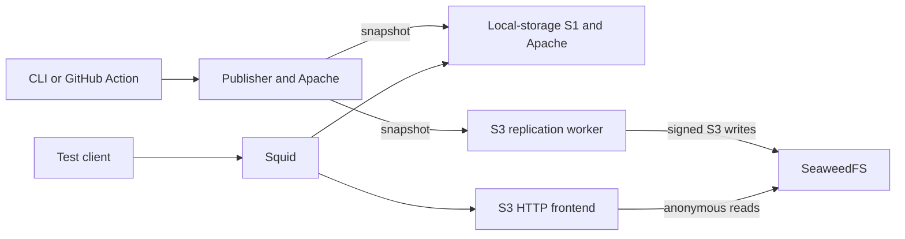

# Architecture and implementation

## Components

Both the local CLI and the action use `testbed.py`. The Python controller invokes
Docker Compose and `cvmfs_server` inside the services. It uses only Python's
standard library. The JavaScript action has no npm dependencies; it invokes the
same controller, exports outputs, and arranges post-job cleanup.

| Service | Software and responsibilities |
| --- | --- |
| `s0` | CernVM-FS client/server tools, OverlayFS publishing mount, Apache, signing keys |
| `s1` | CernVM-FS snapshot tool, local repository object storage, Apache |
| `s1-s3-worker` | CernVM-FS snapshot tool writing directly to the S3 bucket |
| `object-store` | SeaweedFS S3 service with a `cvmfs` bucket |
| `s1-s3` | Nginx translating the public HTTP origin into S3 object reads |
| `squid` | A forward cache accepting requests to the internal `.testbed.test` servers |
| `client` | Optional one-shot FUSE client, trusting the generated public keys |

S0 and the optional client need mount privileges. The replicas, object store,
frontend, and cache do not. Each Compose project has its own bridge network and
named volumes. There are no fixed container names, host ports, or external DNS
requirements. Servers' advertised names are scoped to this Docker network.

## Bootstrap

1. Select the Docker engine's native architecture and build the server image.
2. Start the services and record published host ports.
3. Create the S3 bucket using authenticated S3 requests.
4. Run `cvmfs_server mkfs` for both repositories, generating fresh signing keys.
5. Publish the seed files with `transaction` and `publish`; check the resulting repositories.
6. Run `cvmfs_server check -a` to initialize the S0's native `.cvmfs_status.json` files.
7. Register both replicas with `add-replica`. The S3 worker receives a native S3 backend configuration.
8. Snapshot both repositories on both replicas with `cvmfs_server snapshot`.
9. Copy public keys to the host state directory and verify that manifest revisions and root catalog hashes match.
10. Fetch a repository manifest through Squid to verify the proxy path.

Publication alone does not create S0 monitoring status. The scheduled-check
entry point initializes it; successful later individual checks update it.
Replicas produce their own status during snapshots. Individual timestamp fields,
such as `last_gc`, can be absent. No monitoring payload is fabricated.

## S3 layout

The bucket is `cvmfs`; object keys start with the repository name. For example,
the manifest object is `software.testbed.test/.cvmfspublished`. The HTTP frontend
therefore forwards `/cvmfs/software.testbed.test/.cvmfspublished` to the equivalent
path-style S3 URL. CernVM-FS performs the actual object upload and replication.

Nginx exposes no repository discovery index: `/cvmfs/info/` returns 404. Consumers
must explicitly configure the repository names for this backend. Immutable data
objects receive long-lived cache headers; mutable metadata must be revalidated.
The frontend does not cache responses itself. Its Docker DNS lookup is refreshed
to allow object-store recovery.

Squid caches immutable content but bypasses caching for mutable manifests,
whitelists, status files, and discovery metadata. This fixture policy allows
fresh clients to see deliberately published revisions without sleeping for a
metadata TTL. It is distinct from a production proxy's expiry policy.

The fixed S3 credentials are local fixture values. The writer can administer the
bucket; anonymous callers can read/list it on the private Docker network. No
external S3 account, DNS service, credential, or production signing key is used.

## Control semantics

There are no running cron services or background replication jobs. `publish`
changes S0 only. `replicate` updates exactly the selected replica/repositories.
This is why a lag scenario remains stable while your consumer runs.

Stopping a service retains its container and volumes. Restarting S0 restores its
publishing mounts. Stopping `s1-s3` stops the HTTP frontend and worker together;
stopping `object-store` leaves the frontend running and produces upstream errors.
Pausing uses Docker's process freezer rather than changing configuration.

All mutations for a state directory take an advisory file lock. Independent
deployments may run concurrently. Read-only `status` does not take the mutation
lock, allowing a test to observe an operation while it runs. Endpoint probes are
sequential observations, not an atomic snapshot of a changing distributed system.

The public keys are exported. Private keys remain in S0, and destruction of the
deployment discards them. The default whitelist lifetime is inherited from
CernVM-FS, so this is designed for short-lived test runs rather than an indefinitely
running service. Long sessions may require `cvmfs_server resign` and replication.

## Limits

- This tests publishing, replication, S3 compatibility, and HTTP/client behavior.
  It does not reproduce geographically distributed performance or cloud-provider
  IAM, eventual failure patterns, or service limits.
- GeoIP database updates are disabled (`CVMFS_GEO_DB_FILE=NONE`). A working GeoAPI
  ordering service is not part of the initial fixture. Consumers should disable
  that optional probe or handle its failure. A future profile can supply a fixed
  database and controlled DNS.
- There is no gateway/multi-publisher profile, TLS frontend, GC scenario API, or
  configurable repository naming in this first version. The `exec` command can
  support advanced experiments without extending the basic command interface.
- Image tags and the CernVM-FS package version are explicit. Ubuntu package
  updates and mutable image tags mean a cold image rebuild is not byte-for-byte
  reproducible. Pin the action commit for a stable harness; strict image
  reproducibility would additionally require digests and a package snapshot.
- `up` builds images locally; it does not depend on a separately published
  testbed image or a privileged host CernVM-FS installation.

## Upstream references

- [Repository creation and S3 storage](https://cvmfs.readthedocs.io/en/stable/cpt-repo/)
- [Replica servers and monitoring](https://cvmfs.readthedocs.io/en/stable/cpt-replica/)
- [CernVM-FS server metadata](https://cvmfs.readthedocs.io/en/2.13/cpt-servermeta.html)
- [Upstream replica test helpers](https://github.com/cvmfs/cvmfs/blob/devel/test/test_functions)
- [Related deployments and rationale](related-projects.md)
